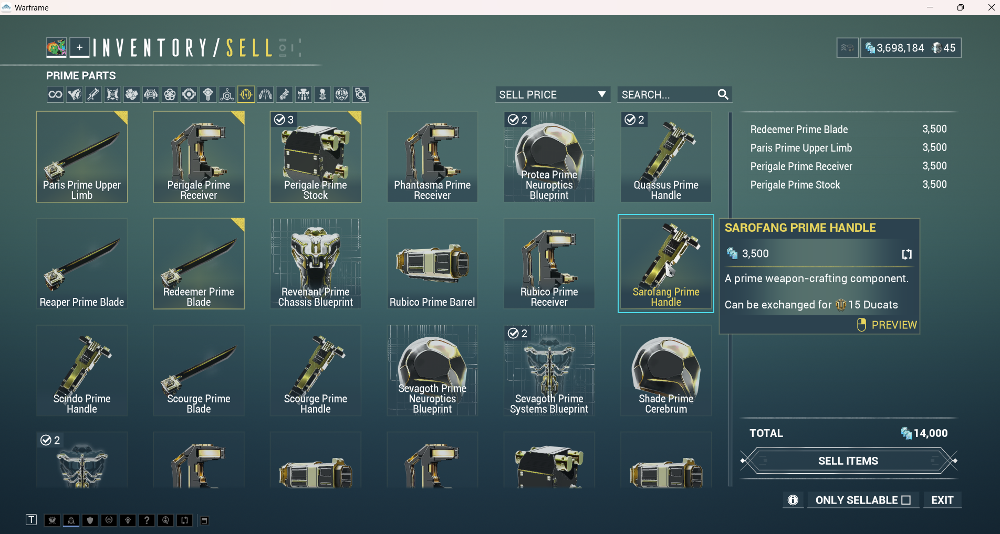
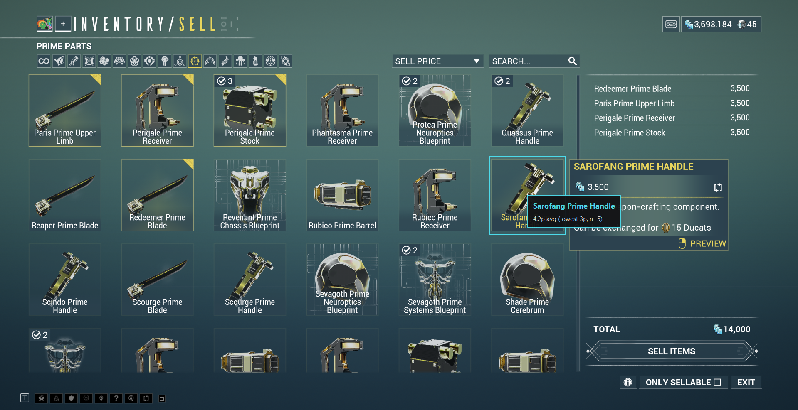
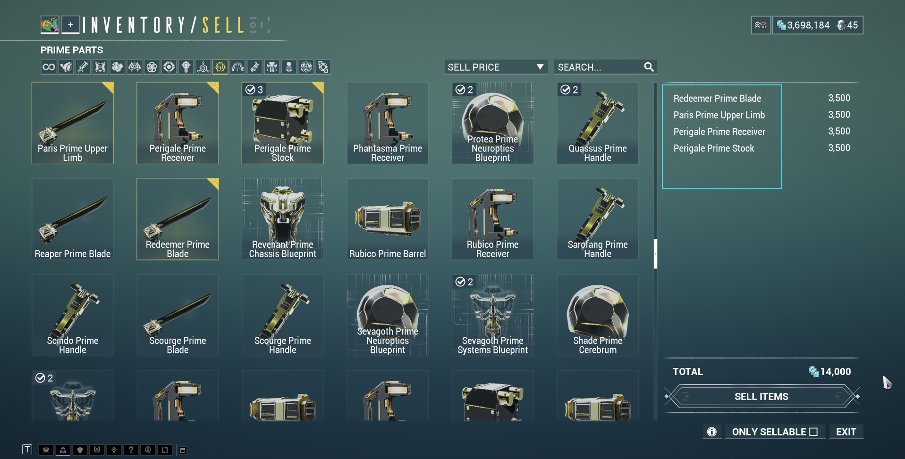
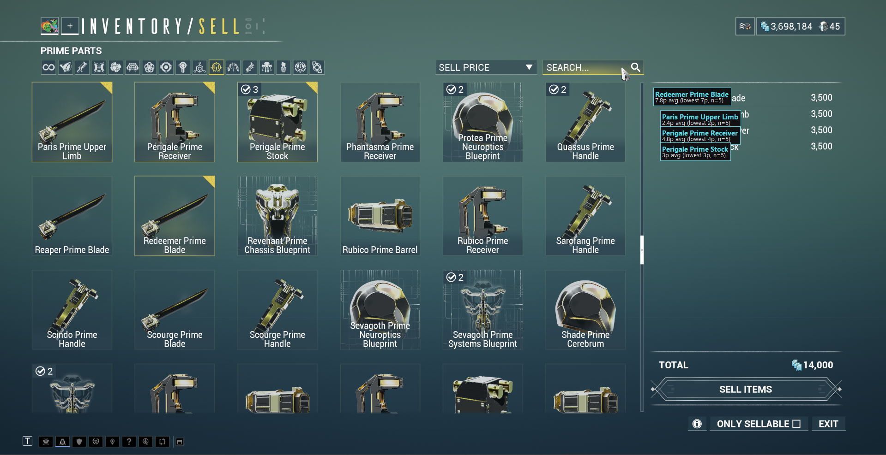

# WF-PriceTracker

An attempt to make pricing your warframe inventory easier.

A Windows app (with a tray icon too) for pricing your Warframe items: set a
box size once, then either check one item at a time by hovering it and
hitting a hotkey, or drag a box around a whole shelf of items at once and
get every one of them priced in place.

## How it works

A window opens when you launch the app, showing status, a live log, and
buttons for everything. There's also a tray icon (cyan diamond = idle, red =
scan mode on) — closing the window with the X just hides it there;
left-click the tray icon or use its "Show window" menu item to bring it
back. Quit fully via the Quit button, the tray menu, or `Ctrl+F10`.

1. **Selection Mode** — pick **Single Item**, **Multi-Select**, or **Grid
   Scan** (radio buttons near the top). Switchable any time, including while
   scan mode is on.
2. **Scan mode** — `F10` (or "Start Scan Mode") toggles scan mode on/off.
   What happens next depends on the selection mode:

   **Single Item** (the classic flow):
   - Once, click **"Set Item Box Size..."** and drag a box around one
     item's icon+name in-game (works live, no screenshot needed first).
     This is the size of the region grabbed around your cursor on every
     scan afterwards.
   - While scan mode is on, hover an item and press `F9` (or click "Scan
     Now"). Grabs a box of your configured size centered on the cursor,
     OCRs it, matches it, and shows the price in a popup next to your
     cursor (auto-dismisses, or click to dismiss early).



   **Multi-Select** (for scanning a whole batch at once):
   - While scan mode is on, left-click-drag a box around however many
     items you want (any size, no pre-calibration needed) and release.
   - That whole region gets captured, OCR'd for every item inside it, and
     each one gets a name+price label drawn directly over it on screen,
     added one at a time as each is found and priced. Labels stay up until
     the next drag (starting a new drag immediately clears the old ones).



   **Grid Scan** (WFInfo-style, most accurate on a full inventory page):
   - One-time setup: click **"Calibrate Grid..."** and drag a box around the
     FIRST (top-left) item's name text, then the LAST (bottom-right) item's
     name text, then enter how many rows and columns the grid has. That
     fixes the exact position of every slot's name label. (Warframe's grid is
     evenly spaced, so first + last + counts pins down the whole thing;
     deriving the spacing from the full span keeps measurement error small.)
   - While scan mode is on, a cyan outline shows the calibrated slots so you
     can confirm they line up. Open your inventory and press `F9`: it grabs a
     few rapid frames of the grid, reads *just each slot's name band* (tightly
     cropped, contrast-boosted, and thresholded to isolate the bright text
     from the animated card art - like WFInfo), votes across the frames for
     each slot, and labels every identified slot with its price.
   - Why the multi-frame vote: Warframe's item-card backgrounds animate, so
     the same slot reads slightly differently frame to frame; voting averages
     out background-induced misreads. If two frames disagree on which item a
     slot is (a tie), that slot is left unlabeled rather than guessed.

   Any mode: results are logged in the window, and appended to
   `data/logs/scans.txt` with a timestamp so you keep a running record
   across a play session. The window log includes the raw text the OCR
   engine actually read (Single/Multi) or per-slot vote detail (Grid, in
   `data/logs/app.log`), so if a scan matches the wrong item (or nothing),
   you can see why.
3. `F10` again turns scan mode off.

Each Single Item scan is one deliberate action covering exactly one item, so
there's no "more prices than items" ambiguity. Multi-Select trades that for
convenience across a freehand region (it can't promise a 1:1 box-to-item
ratio). Grid Scan gets the best of both on a real inventory page: a fixed,
pre-calibrated slot layout means each slot is cropped and read in isolation,
which is the most robust against dense grids and busy backgrounds - at the
cost of the one-time calibration. All three apply the same fuzzy-matching,
Set-exclusion, and "refuse ambiguous ties" rules.

## OCR Engine

Pick which engine reads the crop, via the **"OCR Engine"** dropdown in the
window (persisted across restarts):

- **Tesseract** (default) — a local classical OCR engine. No warm-up cost -
  consistently ~0.2-0.3s per scan once Windows has cached the executable
  (the very first scan of a session might take ~1s extra for that). Fully
  offline.
- **EasyOCR** — a local deep-learning OCR engine. More accurate on
  messy/stylized game text than Tesseract, but pays a one-time ~15s cost
  loading its model the *first* scan of each app run (not per scan); after
  that, roughly a couple of seconds per scan on a small box. No internet
  needed after its one-time model download. Worth switching to if Tesseract
  keeps misreading a particular screen.
- **Claude Vision** / **Gemini Vision** — send the crop to Anthropic's or
  Google's API to read directly instead of running OCR locally. **Currently
  disabled in the UI (still in development)** - the dropdown shows them
  labeled "(in development)" but selecting one snaps back to whatever was
  actually active, and their "Set Anthropic Key..." / "Set Google Key..."
  buttons are greyed out. The underlying code paths work if you set
  `config.OCR_ENGINE` directly (or edit `data/cache/ocr_engine.json`) and
  provide a key via the mechanism below, but there's no supported UI path to
  them yet. When enabled, multi-select region scanning is a known gap for
  these two specifically - the vision prompt currently expects one item per
  image, not a whole region of several.

**Never put a real API key as a literal in `wf_pricer/config.py`** - that
file is tracked by git, so committing it would leak the key. Keys are
meant to live in `data/cache/anthropic_api_key.json` /
`data/cache/google_api_key.json` (both gitignored), or the
`ANTHROPIC_API_KEY` / `GOOGLE_API_KEY` (or `GEMINI_API_KEY`) environment
variables as a fallback.

## Speed: the "Price threads" slider

On a scan with lots of items (Multi-Select or Grid Scan), the slow part isn't
the OCR - it's fetching each item's live price from warframe.market, one
network request per unique item. The **"Price threads"** slider controls how
many of those requests run at once:

- **1 (default, safe)** - fully sequential, exactly the original behaviour.
  Stays within warframe.market's request etiquette (~3 req/s given the
  built-in per-request delay). No risk to your account/IP.
- **Higher** - fetches several prices concurrently, overlapping the network
  latency, so a cold-cache full-grid scan finishes much faster (measured
  ~6x faster on the pricing phase at 6 threads in a mocked test). **But** it
  also issues requests faster: warframe.market may return HTTP 429 or
  temporarily rate-limit your IP if you push it too high. The slider labels
  the zone (`safe` / `polite` / `may rate-limit`) - it's your call how far to
  go, since it's your IP. If scans start failing to price, slide it back down.

Prices are cached for 10 minutes, so re-scanning the same items shortly after
is instant regardless of this setting - the slider only matters for
first-time (cold-cache) lookups. Grid Scan additionally OCRs its multiple
capture frames in parallel when using the Tesseract engine (a safe, local
speedup with no API involved).

## Setup

You need Python 3.11 (EasyOCR's dependencies - PyTorch in particular - don't
reliably have prebuilt wheels for the very newest Python versions yet, so
3.11 is the safe choice; this repo's `.venv` is already set up with it).

```powershell
python -m venv .venv
.venv\Scripts\pip install -r requirements.txt
```

Tesseract (the default engine) needs a separate one-time install:
`winget install --id UB-Mannheim.TesseractOCR -e` (already installed on this
machine at `C:\Program Files\Tesseract-OCR`). EasyOCR is pure Python
(pulling in PyTorch) - no separate install, but downloads its model weights
on first use (needs internet, one-time, cached under
`%USERPROFILE%\.EasyOCR`).

## Running it

```powershell
# with a console window, so you can see what's happening (recommended the first time)
.venv\Scripts\python.exe run.py

# silent, no console window (double-click WF-PriceTracker.bat to do the same)
.venv\Scripts\pythonw.exe run.pyw
```

The tray icon appears once the app is ready. Logs always go to
`data/logs/app.log` regardless of which launcher you use, so if something
seems to silently fail, check there first.

## Usage tips

- **Run Warframe in Borderless Window mode**, not exclusive fullscreen.
  Exclusive fullscreen can prevent both the global hotkeys and the screen
  grab from working reliably; borderless window doesn't have that problem
  and looks identical.
- If hotkeys don't respond while Warframe has focus, try running
  WF-PriceTracker as Administrator — some games/launchers run elevated,
  which blocks keyboard hooks from non-elevated processes.
- **Box size matters (Single Item mode).** Too small and the item's name
  might get cut off (no match); too large and you might catch a neighboring
  item's name instead. Redo "Set Item Box Size..." if scans start missing
  or seem to return the wrong item.
- OCR works best on screens where item names are legible as actual text
  (Mods screen, Relics list, Prime Parts list, etc.). A pure icon with no
  visible name text in your scan box won't match anything - that's a
  fundamental limitation of the OCR approach, not a bug.
- The item catalog is cached for 3 days and prices for 10 minutes
  (`data/cache/`); the **"Refresh Item List"** button forces an immediate
  refetch of the item catalog (e.g. right after a new item drops), bypassing
  that 3-day cache.
- **"Set" listings are always excluded from matching** - e.g.
  "Wisp Prime Set" is a warframe.market trading bundle representing a full
  collection of parts + blueprint, and never appears as its own entry in
  your actual inventory (you only ever see the individual pieces: Barrel,
  Stock, Chassis Blueprint, etc.), so it's never offered as a possible scan
  match, regardless of how the catalog was loaded.
- **If the top two candidate matches are too close in score, the app
  refuses to guess** rather than silently reporting the wrong item - e.g.
  OCR text that's missing an item's part-specific last word (say, just
  "Titania Prime" instead of "Titania Prime Blueprint") ties equally
  against every part of that frame. You'll see "No item recognized" in that
  case instead of a wrong price. Warframe often wraps a long name across 2
  lines within one tile - both scan modes already reconstruct that wrapped
  name automatically, so this mostly shows up if a box/region genuinely
  doesn't capture the full name.
- **Scan speed depends on which engine you picked** - see the **OCR Engine**
  section above.
- **Grid Scan tuning.** Recalibrate ("Calibrate Grid...") whenever the
  inventory layout or window size changes - the calibration is in absolute
  screen pixels. If some slots come back blank, check `data/logs/app.log`
  for the per-slot vote detail, and tune in `config.py`:
  `GRID_BINARIZE_CUTOFF` (raise if backgrounds bleed through, lower if thin
  strokes vanish), `GRID_SCAN_FRAMES` (more frames = better voting but
  slower). Grid Scan works with Tesseract and EasyOCR; the cloud vision
  engines have no batch path so they'd make one API call per slot (slow +
  costly) and aren't recommended for it.
- **Calibrate the grid band tightly around JUST the name text**, not the
  whole tile. If the band reaches up into the icon, it can catch the game's
  own `✓`/quantity badge on owned items (a stray "✓2" reads as garbage that
  ties the item against its family and gets it dropped). A snug band around
  the name label avoids that.
- **Faded / not-owned items** (shown ghosted in the inventory) have dim name
  text that OCR often can't read cleanly, so they may not get a price - not
  much to do about that short of the AI-vision engines.
- **The app hides itself during every scan.** Our result labels, grid
  outline, and the app window all sit on top of the game, so before each
  screen grab they're withdrawn for a split second and restored right after
  (otherwise the scan would read its own labels/window text as items - which
  is exactly what a stale label drawn over an item name would corrupt on a
  re-scan). You may see a brief flicker; that's intentional. Global hotkeys
  keep working while it's hidden.

## Project layout

```
wf_pricer/
  config.py     settings: hotkeys, folders, box size, grid calibration, selection mode, OCR engine + API key storage
  scan.py       screen grabs (cursor box / region / multi-frame), global hotkeys, cursor tracking, drag-select watcher
  ocr.py        Tesseract / EasyOCR / Claude / Gemini engines + Grid Scan name-band preprocessing & montage reader
  items_db.py   warframe.market item catalog fetch/cache + fuzzy matching (excludes Sets, refuses ambiguous ties)
  market.py     warframe.market order fetch/cache (thread-safe) + concurrent get_prices + price averaging
  pipeline.py   price_crop (single) / price_region (multi) / price_grid (grid) - concurrent pricing, parallel grid OCR
  gui.py        app window + overlays (calibration, cursor box, grid outline, multi-result labels, result popup)
  tray.py       tray icon image
  main.py       app entry point (window + tray + hotkeys wiring, all three selection modes)
run.py / run.pyw  launchers (console / silent)
data/           cache, logs (all gitignored)
```
