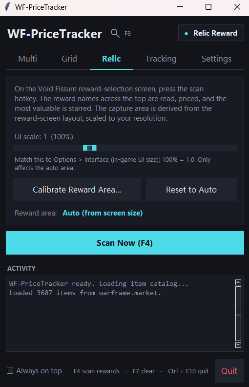
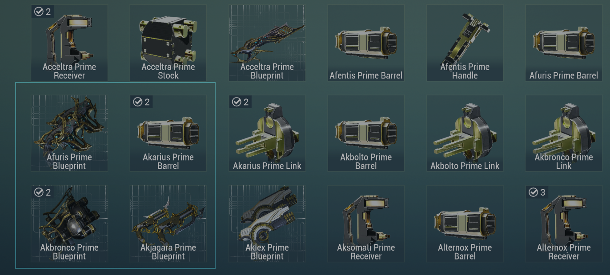
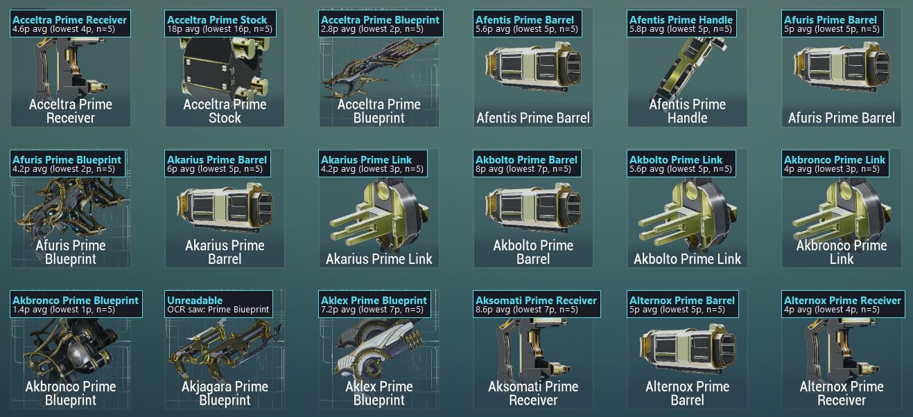
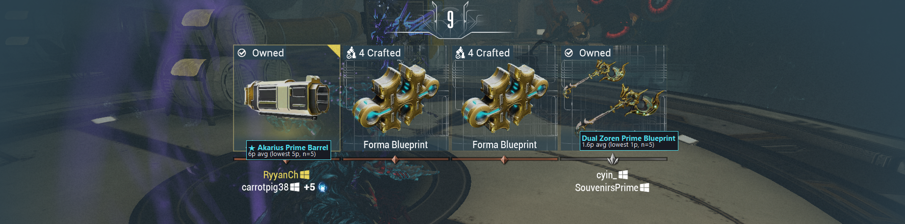
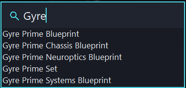
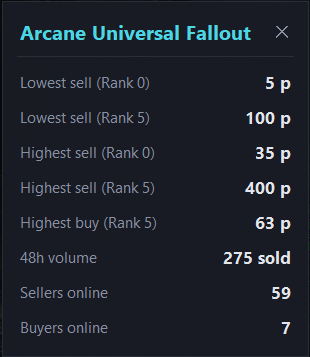
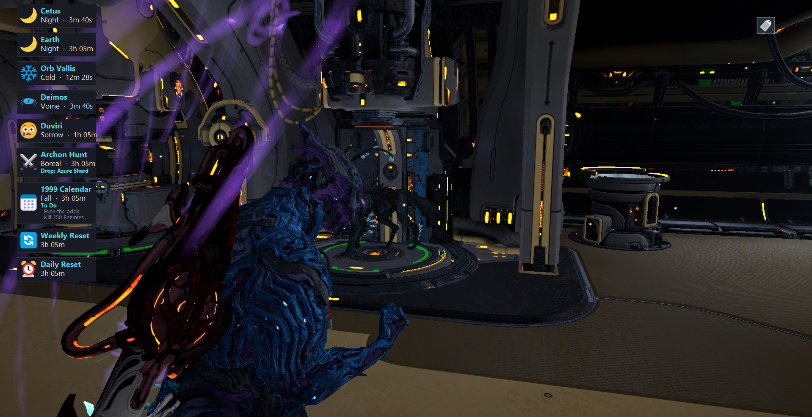
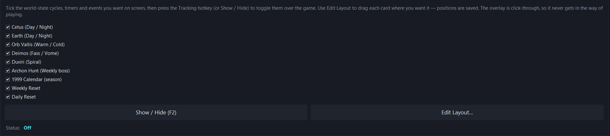
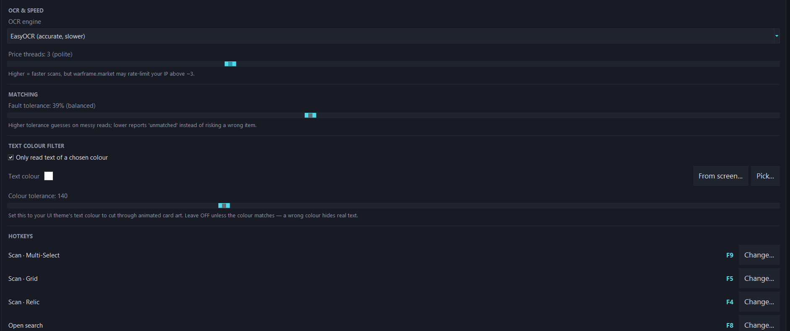

# WF-PriceTracker

A non-invasive desktop companion that prices your Warframe inventory by
**reading your screen with OCR** and looking each item up on **warframe.market**
for you — no game files, memory, or network traffic touched.

<p align="center">
  
</p>

&nbsp;

---

## What is this, and why does it exist?

### A word on Warframe

[Warframe](https://www.warframe.com/) is a free-to-play, third-person
**looter-shooter MMO** by Digital Extremes — you play a space ninja (a "Tenno"
piloting a biomechanical **Warframe**) blasting and slicing through the solar
system for loot. It's a genuinely enormous game: hundreds of weapons,
Warframes, mods, and relics, all grindable for free.

I've personally got **around 250 hours in it as of this update** — enough to
have accumulated the kind of overflowing inventory that makes this tool
worth building.

### Warframe's economy and player trading

What makes Warframe special is its **player-driven economy**. The premium
currency, **Platinum**, can be bought with real money — *or* earned entirely
for free by **trading items with other players**. Prime parts, mods, arcanes,
relics, rivens: almost everything tradable has a going rate in Platinum, and a
dedicated free-to-play player can trade their way to just about anything the
paid shortcut offers. That's the beauty of it — **paid or not, anyone can
participate in the market and make premium currency.**

### warframe.market — and its blind spot

The community coordinates all this trading on
[**warframe.market**](https://warframe.market/): players post buy/sell orders
with prices, and you look up what your stuff is worth before trading.

The catch: **warframe.market has no idea what's in *your* inventory.** It only
knows about listings. So to price your collection, you end up **typing every
single item name into the site one at a time**, reading the going rate, and
moving on to the next. For a full inventory that's tedious, mind-numbing work.

### Why I built this instead of using the existing tools

Tools like **Overframe's companion** and **AlecaFrame** solve the
inventory-awareness problem by integrating far more deeply with the game —
being able to to pull your inventory directly. They're powerful, but that level 
of access is more than I'm comfortable with pointed at my game client.
 **I didn't like the invasiveness**,so I decided to make my own.

**WF-PriceTracker takes the opposite approach: it only looks at pixels already
on your screen.** It **OCRs** whatever inventory screen you're looking at,
**fuzzy-matches** the text to real item names, and **fetches live prices from
warframe.market** — turning "type in 40 item names by hand" into "press a
hotkey." It reads nothing but the screen you're already showing anyone who
walks past your monitor. (This is the same non-invasive philosophy as
[WFInfo](https://github.com/WFCD/WFinfo), the well-known relic-reward OCR tool
that inspired the Grid Scan mode.)

---

## Built with

The software-development side of things, for the curious:

| Area | Tools |
|------|-------|
| **Language** | Python 3.11 |
| **GUI** | Tkinter / ttk (standard library), with a hand-rolled dark theme |
| **Local OCR** | [Tesseract](https://github.com/tesseract-ocr/tesseract) (via `pytesseract`), [EasyOCR](https://github.com/JaidedAI/EasyOCR) (PyTorch deep-learning) |
| **Image handling** | [Pillow](https://python-pillow.org/) |
| **Fuzzy matching** | [RapidFuzz](https://github.com/maxbachmann/RapidFuzz) |
| **Global hotkeys & mouse tracking** | [pynput](https://github.com/moses-palmer/pynput) |
| **System tray** | [pystray](https://github.com/moses-palmer/pystray) |
| **HTTP** | [requests](https://requests.readthedocs.io/) |
| **Market data** | the [warframe.market API](https://warframe.market/) — v2 orders endpoint for live prices, v1 statistics endpoint (best-effort) for 48-hour trade volume |
| **Windows integration** | `ctypes` for DPI awareness, screen metrics, and foreground-focus handling |

---

## Features at a glance

The window is organised into tabs — **Multi-Select**, **Grid Scan**, **Relic
Reward**, **Tracking**, and **Settings** — plus a magnifying-glass **search**
button in the top-left. A tray icon (a cyan diamond) keeps it out of the way;
closing the window with the X just hides it to the tray. Quit fully via the
**Quit** button, the tray menu, or the quit hotkey (`Ctrl+F10` by default).

Each scan mode has its **own** hotkey (defaults `F9` Multi-Select, `F5` Grid,
`F4` Relic), so pressing it scans in that mode directly — no need to switch tabs
first.

### Multi-Select

Price a whole shelf of items at once. Press **Select Area** (or its hotkey,
`F9`) to arm a **one-shot** selection, drag a box around however many items you
want, and release. The entire region is captured, OCR'd for every item inside,
and each one gets a **name + price label drawn directly over it on screen**,
filled in one at a time as each is found and priced. Labels stay up until your
next selection.

It's deliberately one-shot: the app only takes over the mouse once you ask it
to, and hands it straight back on release — so your clicks stay yours the rest
of the time.

<p align="center">
  
  <br><em>Drag a one-shot box around any batch of items.</em>
</p>

&nbsp;

### Grid Scan (WFInfo-style — most accurate on a full inventory page)

Calibrate a fixed grid of inventory slots once (box the first and last slot's
name text, enter the rows/columns), then press the scan hotkey with your
inventory open. It grabs a few rapid frames, reads **just each slot's name
band** (tightly cropped and contrast-boosted to isolate the bright text from
the animated card art), **votes across the frames**, and labels every slot with
its price.

- **Multi-frame voting** cancels out the misreads caused by Warframe's animated
  item-card backgrounds. If frames disagree on a slot (a tie), it's left
  unlabeled rather than guessed.
- **Automatic retries:** unresolved slots are re-read with different
  preprocessing (dimmer thresholds, no binarization, harder contrast) — a label
  one threshold erases, another often reads perfectly. Slots still unidentified
  after every attempt are marked **Unreadable** (with the best text OCR
  managed), so "couldn't read this" is distinct from "empty slot".

<p align="center">
  
  <br><em>Grid Scan: every calibrated slot labelled with its price (unreadable slots flagged, not guessed).</em>
</p>

&nbsp;

### Relic Reward (Void Fissure reward screen)

On the **Void Fissure reward-selection screen**, press the Relic hotkey (`F4` by
default). The app reads the up-to-four reward names across the top, prices each,
and **stars the most valuable** so you know what to pick before the timer runs
out. The capture area is derived from the reward-screen layout scaled to your
resolution — or calibrate it once on the **Relic** tab if your HUD scale differs.

<p align="center">
  
  <br><em>Relic Reward: the four choices priced in place, the most valuable starred.</em>
</p>

&nbsp;

### Search — look up any item by name

Click the **magnifying-glass icon** (top-left, next to the title) or press the
**search hotkey** (`F8` by default). The search hotkey pops a small, already-
focused search bar anywhere — no need to bring up or click into the main window
— so you can price-check mid-game without alt-tabbing.

Type an item name (with live **autocomplete** over the full catalog, Sets
included), press Enter, and a compact **stats popup** shows its live market
picture from warframe.market:

- **Lowest / Highest sell** and **Highest buy** — the current order book.
- **For ranked items (mods, arcanes),** each of those is split into its value
  at the **lowest and highest rank** on the book (a Rank 0 and a Rank 5 arcane
  are completely different prices).
- **48h volume** — how many traded in the last two days (best-effort).
- **Sellers / Buyers online** — a live read on supply and demand.

<p align="center">
  
  <br><em>The quick-search bar with live autocomplete.</em>
</p>

<p align="center">
  
  <br><em>The stats popup — a ranked arcane, split into per-rank prices.</em>
</p>

&nbsp;

### Tracking — live world-state HUD

The **Tracking** tab drives a click-through overlay of live Warframe timers you
can drag anywhere on screen and toggle with a hotkey (`F6` by default). Tick
what you want and press **Show / Hide**:

- **Location cycles** — Cetus & Earth day/night, Orb Vallis warm/cold, Deimos
  Fass/Vome, Duviri Spiral.
- **Archon Hunt** — the weekly boss and its **Archon Shard** drop.
- **1999 Calendar** — the active season plus **today's event** (its type, name
  and objective).
- **Daily / Weekly reset** timers — computed locally, so they keep counting even
  if the world-state API is down.

**Edit Layout** lets you drag each card where you want it; positions are saved.
The overlay is click-through, so it never eats a click while you play.

<p align="center">
  
  <br><em>The Tracking HUD over the game — cycles, Archon Hunt (+shard), the 1999 calendar, and reset timers.</em>
</p>

<p align="center">
  
  <br><em>The Tracking tab: tick the cards you want, then Show / Hide or Edit Layout.</em>
</p>

&nbsp;

---

## The Settings tab

Everything configurable lives on the **Settings** tab, grouped into sections.
Changes are saved under your per-user data folder
(`%LOCALAPPDATA%\WF-PriceTracker\cache` on Windows) and persist across restarts.

<p align="center">
  
</p>

&nbsp;

### OCR & speed

- **OCR engine** — which engine reads each crop (see
  [OCR: how it reads, and where it fails](#ocr-how-it-reads-and-where-it-fails)
  below).
- **Price threads** — how many warframe.market price lookups run at once. On a
  big scan the slow part isn't the OCR, it's the one-network-request-per-item
  pricing. `1` is fully sequential and safest; higher overlaps the network
  latency for much faster cold-cache scans, but issues requests faster too, so
  warframe.market may rate-limit your IP if you push it. The slider labels the
  zone (`safe` / `polite` / `may rate-limit`) — it's your IP, your call.
  (Prices are cached for 10 minutes, so this only matters for first-time
  lookups.)

### Matching

- **Fault tolerance** — this is the dial for *where the app decides to guess vs.
  give up*. OCR is imperfect; this controls how close a read has to be to a real
  item name before the app commits to a match. **Higher tolerance** guesses on
  messier reads (at the risk of the occasional wrong guess); **lower tolerance**
  reports "unmatched" rather than risk reporting the wrong item. If you're
  seeing wrong matches, dial it down; if too many reads come back unmatched,
  dial it up.

### Hotkeys

Every hotkey is **rebindable** — click **"Change…"** and press the key or
combo you want. Each scan mode has its **own** key, so it fires that mode
directly no matter which tab is open — no need to switch modes first. Defaults:

| Action | Default | What it does |
|--------|---------|--------------|
| Scan · Multi-Select | `F9` | Arm a one-shot area pick, then price everything in it |
| Scan · Grid | `F5` | OCR and price every calibrated inventory slot |
| Scan · Relic | `F4` | Read and price the Void Fissure reward names |
| Open search | `F8` | Pop the quick-search bar |
| Clear overlays | `F7` | Wipe every on-screen price label / outline |
| Toggle tracking | `F6` | Show/hide the world-state HUD |
| Quit app | `Ctrl+F10` | Quit entirely |

The current **search** binding is also shown right next to the magnifier icon
in the header, so the shortcut stays discoverable.

### Text colour filter

- **Only read text of a chosen colour** — restrict OCR to your UI theme's text
  colour so it cuts through Warframe's animated card art. Set it with the
  on-screen **eyedropper** (freeze the screen, magnify, click a pixel) or a
  colour picker. Leave it off unless the colour matches — a wrong colour hides
  the real text.

### Catalog

- **Refresh Item List** — force an immediate refetch of the warframe.market item
  catalog (e.g. right after a new item drops), bypassing the 3-day cache.

---

## OCR: how it reads, and where it fails

**OCR is not magic, and it is not infallible.** The whole approach rests on
turning pixels of stylised game text into characters, and that can and does
fail. It's important to understand the failure modes rather than expecting 100%:

- **Faded / not-owned items** (shown ghosted in the inventory) have dim text
  that OCR frequently can't read cleanly — they may simply not get a price.
- **Icon-only tiles** with no visible name text can't be matched at all — OCR
  needs actual text to read.
- **Decorative fonts, busy animated backgrounds, and owned-item badges** (the
  `✓`/quantity marker) all interfere, which is exactly what Grid Scan's
  multi-frame voting and retry profiles are there to fight.
- **A too-small box** clips the name (no match); **too-large** catches a
  neighbour's name. Even a perfect engine can't match text it wasn't given.

When a read is genuinely ambiguous, the app **refuses to guess** rather than
report a wrong price — you'll see "No item recognized" or an **Unreadable**
label instead. The **Fault tolerance** slider (above) lets you move that
guess-vs-refuse line to taste.

### The OCR engines

Choose per your priorities — speed, accuracy, offline vs. online, free vs. paid:

- **Tesseract** *(default)* — local, classical OCR. No warm-up, ~0.2–0.3s per
  scan, fully offline. The pragmatic day-to-day default.
- **EasyOCR** — local, **deep-learning** OCR. More accurate on messy/stylised
  game text, but pays a one-time ~15s model-load on the first scan of each run,
  then a couple of seconds per scan. Fully offline after its one-time model
  download. Switch to it if Tesseract keeps misreading a particular screen.

---

## Download (Windows)

Grab the latest **`WF-PriceTracker.exe`** from the
[**Releases**](../../releases/latest) page and double-click it — no Python
needed. The packaged exe uses the **Tesseract** engine, which is a separate
one-time install: `winget install --id UB-Mannheim.TesseractOCR -e`.

Want **EasyOCR** (more accurate on stylised text) or to hack on the code? Run
from source instead — see Setup below. Building the exe yourself is documented in
[RELEASING.md](RELEASING.md).

## Setup

You need **Python 3.11** (EasyOCR's dependencies — PyTorch in particular —
don't reliably have prebuilt wheels for the newest Python versions yet).

```powershell
python -m venv .venv
.venv\Scripts\python.exe -m pip install -e .
```

`pip install -e .` reads [`pyproject.toml`](pyproject.toml) and installs the app
(and its dependencies) in editable mode, which also registers a `wf-pricer`
command. If you'd rather not install, `pip install -r requirements.txt` still
works — the launchers put `src/` on the path themselves.

Tesseract (the default engine) needs a separate one-time install:
`winget install --id UB-Mannheim.TesseractOCR -e`. EasyOCR is pure Python
(pulling in PyTorch) — no separate install, but downloads its model weights on
first use (one-time, cached under `%USERPROFILE%\.EasyOCR`).

## Running it

```powershell
# installed entry point (after `pip install -e .`)
.venv\Scripts\wf-pricer.exe
# or, equivalently:
.venv\Scripts\python.exe -m wf_pricer

# with a console window, no install needed (good for first-time debugging)
.venv\Scripts\python.exe run.py

# silent, no console window (double-click WF-PriceTracker.bat to do the same)
.venv\Scripts\pythonw.exe run.pyw
```

The tray icon appears once the app is ready. Runtime data (cache, logs) lives in
your per-user data folder — on Windows `%LOCALAPPDATA%\WF-PriceTracker`. Logs go
to `…\WF-PriceTracker\logs\app.log`, so if something seems to silently fail,
check there first.

## Usage tips

- **Run Warframe in Borderless Window mode**, not exclusive fullscreen.
  Exclusive fullscreen can block the global hotkeys, the screen grab, and the
  quick-search focus; borderless window looks identical and avoids all of it.
- If hotkeys don't respond while Warframe has focus, try running WF-PriceTracker
  **as Administrator** — some launchers run elevated, which blocks keyboard
  hooks from non-elevated processes.
- **"Set" listings are always excluded from scan matching** (e.g. "Wisp Prime
  Set" is a trading-bundle listing, never a real inventory entry — you only ever
  hold the individual pieces). *Manual search does include Sets*, since you
  might genuinely want to price the full bundle.
- OCR works best where item names are legible text (Mods, Relics, Prime Parts
  screens). See the OCR section above for the limits.
- The item catalog is cached for 3 days, prices for 10 minutes (in your
  per-user data folder — see Setup).
- **Calibrate the Grid band tightly around JUST the name text**, not the whole
  tile, so it doesn't catch the game's `✓`/quantity badge on owned items.
  Recalibrate whenever the inventory layout or window size changes.
- **The app hides itself during every scan** — its labels/outline/window all sit
  over the game, so they're withdrawn for a split second before each grab and
  restored right after (otherwise a scan would read its own labels as items).
  The brief flicker is intentional; global hotkeys keep working while hidden.
- **Any time you drag out a box** — setting the item box size, calibrating the
  grid, or picking a Multi-Select region — the screen **dims and the app
  captures your mouse** for that one drag. Nothing you click reaches the game,
  so you can't accidentally select, equip, or highlight anything while
  measuring. Press **Esc** (or right-click) to back out.

---

## Status — a passion project

To be clear about what this is: **a passion project.** It exists only because
Warframe offers no official, public way to read your own inventory
programmatically — so screen-reading with OCR is the polite, non-invasive
workaround, warts and all.

The day Warframe (Digital Extremes) publicises an API or service to get
inventory details properly, I'll happily retire this — and either just **use
whatever official app that enables, or build another one, properly this time**,
on top of real data instead of pixels. Until then, this scratches the itch
without hooking into anything it shouldn't.

---

## Project layout

```
pyproject.toml    packaging, dependencies, `wf-pricer` entry point, tool config
run.py / run.pyw  no-install launchers (console / silent); WF-PriceTracker.bat wraps run.pyw
src/wf_pricer/
  config.py     settings: hotkeys, folders (per-user data dir), grid calibration,
                selection mode, OCR engine, match tolerance, price threads, tracking layout
  scan.py       screen grabs, global hotkeys, drag-select watcher, click-through +
                Windows foreground-focus helpers
  ocr.py        Tesseract / EasyOCR engines + name-band preprocessing
  items_db.py   catalog fetch/cache + two-stage anchored fuzzy matching (excludes Sets,
                refuses ambiguous ties) + full-catalog search index
  market.py     warframe.market order fetch/cache (thread-safe), concurrent pricing,
                per-item stats (order book, per-rank tiers, 48h volume)
  pipeline.py   price_region (multi) / price_relic (relic) / price_grid (grid)
  worldstate.py Tracking HUD data: live cycles, Archon Hunt, 1999 calendar
                (warframestat.us) + daily/weekly reset timers (computed locally)
  glyphs.py     emoji icons rendered to images for the HUD
  gui.py        tabbed window, dark theme, overlays, quick-search + stats popups
  tray.py       tray icon image
  main.py       app wiring (window + tray + hotkeys); `python -m wf_pricer` via __main__.py
tests/          test_matching.py (matcher accuracy)
assets/         screenshots + icon.ico
scripts/build.py         builds the exe via PyInstaller
WF-PriceTracker.spec     PyInstaller build spec (Tesseract-only, windowed, one-file)
.github/workflows/       release.yml — builds the exe + publishes a Release on a v* tag
```

Runtime data (cache, logs) is written to a per-user data dir outside the repo
(`%LOCALAPPDATA%\WF-PriceTracker` on Windows), not committed. Build artifacts
(`build/`, `dist/`) are gitignored — the exe ships via GitHub Releases (see
[RELEASING.md](RELEASING.md)).
